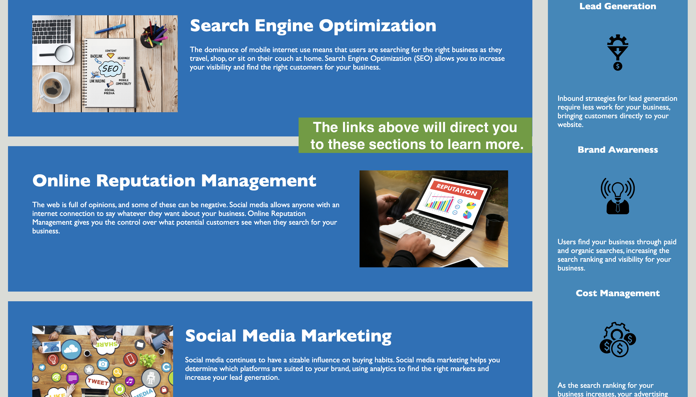

# challengeOneUT
<a href="https://l-jones-hub.github.io/Accessiblity-Challenge/" target="_blank">Deployed Page</a>

## Description

This project's purpose was to refactor and debug existing code for the Horiseon homepage to make it more accessible. The changes made will improve the page's interactions with assistive technologies. 

## Usage

Click on the links in the navigation bar at the top-right of the screen to navigate to each section and learn more about Horiseon.

## Credits

The starter code for this project was provided by the University of Texas bootcamp instructor.

